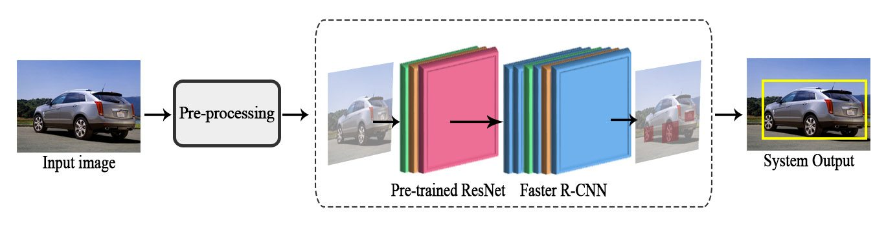
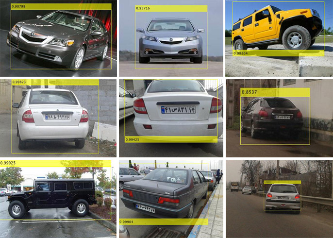

# Vehicle Detection based on Faster R-CNN
This project is a vehicle detection application for vision-based Intelligent Transportation Systems (ITS). These systems utilize roadway camera outputs to apply video processing techniques and extract the desired information, which is vehicles' visual features in this special case.



## Algorithms/Architectures
1. **Faster R-CNN**: Since deep learning has become a popular research subject of machine learning and attracted a huge attention compared to the traditional approaches, we have utilized Deep Neural Network (DNN) in this project. Among different DNN and CNN approaches, Faster R-CNN is another approach similar to Fast CNN in which the region proposals are extracted by the means of a separate network instead of utilizing the selective search module ([read more](https://www.researchgate.net/publication/277722488_Faster_R-CNN_Towards_Real-Time_Object_Detection_with_Region_Proposal_Networks "read more"))
1. **ResNet-50**: is a 50 layer residual network and the main purpose of utilizing this framework is to improve the classification results, besides preventing accuracy degradation in training deeper layers.

## Inputs/Outputs of the System
The input of the system can be a single or set of vehicle images for training/testing purposes. The ouput of the system is the same image(s) with visual bounding-boxes to cover vehicle inside the image. Sample result can be seen in below image:



## Environment
The project is implemented by MATLAB 2018 with the aid of its deep learning libraries. There are several standard datasets to train/test the project like the Cars Dataset by Stanford Artificial Intelligence Library ([link](https://ai.stanford.edu/~jkrause/cars/car_dataset.html "link")) and other standard real condition vehicle datasets.

## Publications and CopyRight

We have presented the architecture, experiments and calibration settings in the paper below:

```
@inproceedings{Tourani2019,
	author = {Tourani, Ali and Soroori, Sajjad and Shahbahrami, Asadollah and Khazaee, Saeed and Akoushideh, Alireza},
	title = {{A Robust Vehicle Detection Approach based on Faster R-CNN Algorithm}},
	booktitle = {4th International Conference on Pattern Recognition and Image Analysis, IPRIA 2019},
	doi = {10.1109/PRIA.2019.8785988},
	isbn = {9781728116211},
	pages = {119--123},
	year = {2019}
}
```
